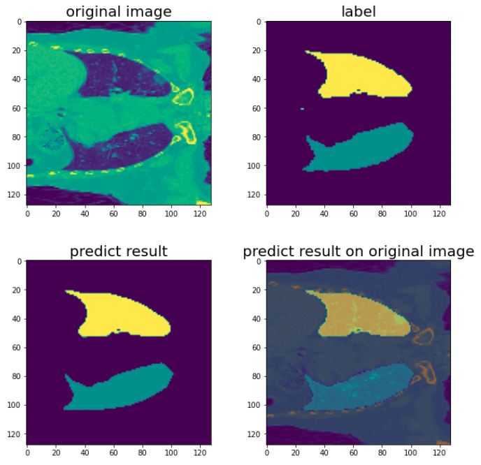

# Paddleseg3D
Welcome to PaddleSeg3D! PaddleSeg3D is a easy-to-use 3D medical image segmentation toolkit that covers various datasets including lung, brain and spine.

## 0. Model performance
We have sucessfully validate our framework with [Vnet](https://arxiv.org/abs/1606.04797) on the [COVID-19 CT scans](https://www.kaggle.com/andrewmvd/covid19-ct-scans) dataset. With lung mask as label, we reach dice coefficient of 97.04%. You can download the log to see the result or load the model and validate by yourself :).

| Backbone | Resolution | lr | Training Iters | Dice | Links |
|:-:|:-:|:-:|:-:|:-:|:-:|
|-|128x128x128|0.001|15000|97.04%|[model](https://bj.bcebos.com/paddleseg/paddleseg3d/lung_coronavirus/vnet_lung_coronavirus_128_128_128_15k_1e-3/model.pdparams) \| [log](https://bj.bcebos.com/paddleseg/paddleseg3d/lung_coronavirus/vnet_lung_coronavirus_128_128_128_15k_1e-3/train.log) \| [vdl](https://paddlepaddle.org.cn/paddle/visualdl/service/app?id=9db5c1e11ebc82f9a470f01a9114bd3c)|
|-|128x128x128|0.0003|15000|92.70%|[model](https://bj.bcebos.com/paddleseg/paddleseg3d/lung_coronavirus/vnet_lung_coronavirus_128_128_128_15k_3e-4/model.pdparams) \| [log](https://bj.bcebos.com/paddleseg/paddleseg3d/lung_coronavirus/vnet_lung_coronavirus_128_128_128_15k_3e-4/train.log) \| [vdl](https://www.paddlepaddle.org.cn/paddle/visualdl/service/app/scalar?id=0fb90ee5a6ea8821c0d61a6857ba4614)|

The segmentation result of our vnet model is as following:
<div align="center">

</div>

## 1. Get started
1. Download our repo.
    ```
    git clone  https://github.com/PaddleCV-SIG/PaddleSeg3D.git
    cd PaddleSeg3D/
    ```
2. Install requirements:
    ```
    pip install -r requirements.txt
    ```
3. Run the train and validation example in multiple GPU. (Refer to the following usage to get the correct result.)
   ```
   sh run-vnet.sh
   ```


## 2. Usage
This part shows you how to change your configuration and start training.
Basically, if you don't need to add new code, you only need to focus on configuration、training and validation setting.

### 2.1 Set configuration
Our code configs model based on \_base\_ config and dataset-related config.
1. \_base\_ config:

    All the config files inherit this one(./configs/\_base\_/global.yml), you need to set your data path here and ensure you have enough space under this path.

2. dataset base config:

    This kind of config files set all the configurations except for models' config, you can change configs about loss, optimizer, dataset and so on in this file. (path example: ./configs/xx_dataset/xx_dataset.yml)

3. model-related config:

    This config inherit the data base config and you can change the model config here.(path example: ./configs/xx_dataset/xxnet_dataset.yml)

### 2.2 Train & Validate
After change your config, you are ready to train your model. A basic training and validation example is ./run-vnet.sh. Let's see some of the training and validation configuration in this file.
```bash
# set your GPU ID here
export CUDA_VISIBLE_DEVICES=0

# set the config file name and save directory here
yml=vnet_lung_coronavirus_128_128_128_15k
save_dir=saved_model/${yml}
mkdir save_dir

# Train the model: see the train.py for detailed explanation on script args
python3 train.py --config configs/lung_coronavirus/${yml}.yml \
--save_dir  $save_dir \
--save_interval 500 --log_iters 100 \
--num_workers 6 --do_eval --use_vdl \
--keep_checkpoint_max 5  --seed 0  >> $save_dir/train.log

# Validate the model: see the val.py for detailed explanation on script args
python3 val.py --config configs/lung_coronavirus/${yml}.yml \
--save_dir  $save_dir/best_model --model_path $save_dir/best_model/model.pdparams

```

## 3. Train on your dataset
If you want to train on your dataset, simply add a dataset file and configuration file, and you are good to go. Details on how to add can referred to the dataset file and the configurations(./paddleseg3D/datasets/, ./configs).

## 4. Acknowlegement
Thanks [PaddleSeg](https://github.com/PaddlePaddle/PaddleSeg) for their wonderful framework design that we borrowed from.  
