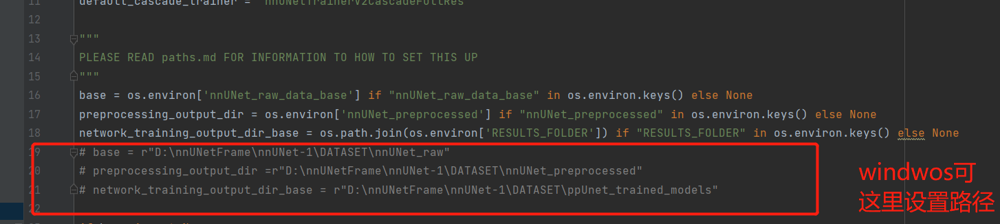
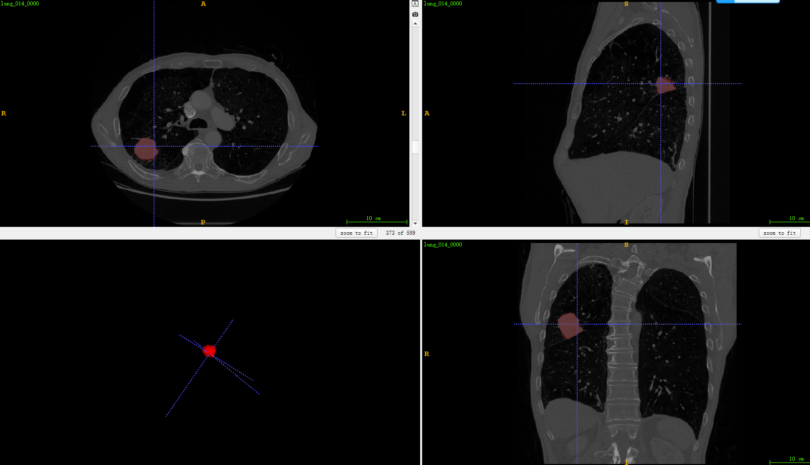
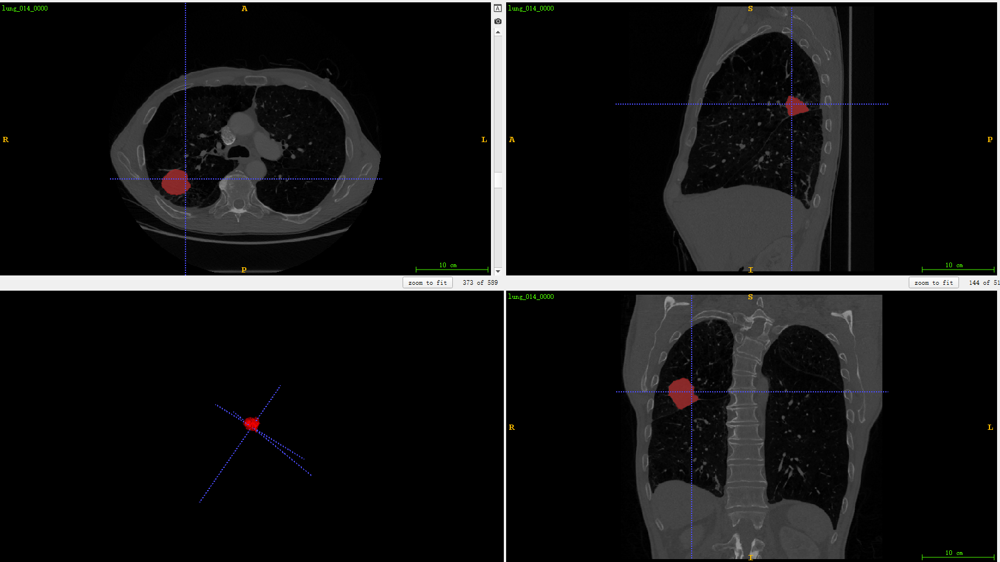

# AI-Studio-nnUnet论文复现


## 项目描述
> Unet模型自从2015年提出以来，在医学图像分割领域一直占据着举足轻重的地位。
> 我们知道医学图像有很多是基于3d的，所以后来也有学者提出了3dunet模型。
> 但是对于深度学习来说超参的控制一直影响着模型最终的一个结果。
> nnUnet这篇论文并没有提出新的模型，而是在unet模型基础上根据图像数据的spacing信息和尺寸信息形成了一套能够自适应的调参工具。
> nnUnet工具在许多医学领域的比赛上取得了很不错的成绩。


**论文：**

- [nnU-Net: Self-adapting Framework for U-Net-Based Medical Image Segmentation](https://arxiv.org/abs/1809.10486)

**项目参考：**
- [https://github.com/MIC-DKFZ/nnUNet](https://github.com/MIC-DKFZ/nnUNet)


## 快速开始
### 第一步：克隆本项目
#### git clone https://github.com/YellowLight021/pp_nnUnet
#### cd MedicalSeg 
###第二步：需要安装的库
####pip install -r requirements.txt

```
├── configs         # 关于训练的配置，每个数据集的配置在一个文件夹中。基于数据和模型的配置都可以在这里修改
├── data            # 存储预处理前后的数据
├── deploy          # 部署相关的文档和脚本
├── medicalseg  
│   ├── core        # 训练和评估的代码
│   ├── datasets  
│   ├── models  
│   ├── transforms  # 在线变换的模块化代码
│   └── utils  
├── export.py
├── run-unet.sh     # 包含从训练到部署的脚本
├── tools           # 数据预处理文件夹，包含数据获取，预处理，以及数据集切分
├── train.py
├── val.py
└── visualize.ipynb # 用于进行 3D 可视化
```


## 第三步：准备工作
[MSD-Lung ](https://drive.google.com/drive/folders/1HqEgzS8BV2c7xYNrZdEAnrHk7osJJ–2) 

1、下载解压数据集到你觉得合适的位置。（如解压到f盘，数据集就是F:\Task05_Prostate）

2、建立一个文件夹Dataset。在该文件夹下在建立nnUNet_preprocessed、nnUNet_raw、nnUNet_trained_models文件夹

3、在如上建立的nnUNet_raw文件夹下面在建立nnUNet_cropped_data、nnUNet_raw_data两个文件夹

## 第四步：数据格式转换

1、配置路径信息，将paths.py文件中的路径改成，刚刚新建Dataset文件夹的对应路径。如图 

2、cd tools/experiment_planning。

3、执行命令：python nnUNet_convert_decathlon_task.py -i F:\Task06_Lung（这个是你解压数据集的位置）

4、执行成功后，刚刚建立的Dataset\nnUnet_raw\nnUNet_raw_data文件夹下应该出现了Task006_Lung文件夹。

## 第五步：训练计划制定以及preprocessing

1、还是cd tools/experiment_planning。

2、执行命令：python nnUNet_plan_and_preprocess.py -t 6

3、执行成功后，Dataset\nnUnet_raw\nnUNet_preprocessed下应该出现Task006_Lung文件夹。

## 第六步：模型训练

1、执行python run_training.py

2、2d模式unet训练命令：
```
python run_training.py 2d nnUNetTrainerV2 6 4 --npz --max_num_epochs 70 --num_batches_per_epoch 250
python run_training.py 2d nnUNetTrainerV2 6 3 --npz --max_num_epochs 70 --num_batches_per_epoch 250
python run_training.py 2d nnUNetTrainerV2 6 2 --npz --max_num_epochs 70 --num_batches_per_epoch 250
python run_training.py 2d nnUNetTrainerV2 6 1 --npz --max_num_epochs 70 --num_batches_per_epoch 250
python run_training.py 2d nnUNetTrainerV2 6 0 --npz --max_num_epochs 70 --num_batches_per_epoch 250
```
3、3dlower模型unet训练：
```
python run_training.py 3d_lowres nnUNetTrainerV2 6 4 --max_num_epochs 55 --num_batches_per_epoch 250
python run_training.py 3d_lowres nnUNetTrainerV2 6 3 --max_num_epochs 55 --num_batches_per_epoch 250
python run_training.py 3d_lowres nnUNetTrainerV2 6 2 --max_num_epochs 55 --num_batches_per_epoch 250
python run_training.py 3d_lowres nnUNetTrainerV2 6 1 --max_num_epochs 55 --num_batches_per_epoch 250
python run_training.py 3d_lowres nnUNetTrainerV2 6 0 --max_num_epochs 55 --num_batches_per_epoch 250
```

4、3DUnet-cascade模型训练：
```
python run_training.py 3d_cascade_fullres nnUNetTrainerV2CascadeFullRes 6 4 --max_num_epochs 110 --num_batches_per_epoch 250
python run_training.py 3d_cascade_fullres nnUNetTrainerV2CascadeFullRes 6 3 --max_num_epochs 110 --num_batches_per_epoch 250
python run_training.py 3d_cascade_fullres nnUNetTrainerV2CascadeFullRes 6 2 --max_num_epochs 110 --num_batches_per_epoch 250
python run_training.py 3d_cascade_fullres nnUNetTrainerV2CascadeFullRes 6 1 --max_num_epochs 110 --num_batches_per_epoch 250
python run_training.py 3d_cascade_fullres nnUNetTrainerV2CascadeFullRes 6 0 --max_num_epochs 110 --num_batches_per_epoch 250
```

5、注意训练3DUnet-cascade模型时候必须要先训练3dlower，3dlower训练完成后会输出predict的文件作为cascade的补充输入。


6、模型的训练日志都放在log文件夹下了。模型参数的链接： 链接：https://pan.baidu.com/s/1OZSvdstuAOLZ8haR3pNl9g 提取码：dzxs 


## 第七步：模型evaluation
1、对3DUnet-cascade进行验证
```
1、python run_training.py 3d_cascade_fullres nnUNetTrainerV2CascadeFullRes 6 4 -val --valbest
2、python run_training.py 3d_cascade_fullres nnUNetTrainerV2CascadeFullRes 6 4 -val --valbest
3、python run_training.py 3d_cascade_fullres nnUNetTrainerV2CascadeFullRes 6 4 -val --valbest
4、python run_training.py 3d_cascade_fullres nnUNetTrainerV2CascadeFullRes 6 4 -val --valbest
5、python run_training.py 3d_cascade_fullres nnUNetTrainerV2CascadeFullRes 6 4 -val --valbest
6、交叉验证后得到最佳配置为fold3的dice值最高达到69.2%，验证日志在log下
```
2、对2DUnet进行交叉验证
```
1、python run_training.py 2d nnUNetTrainerV2 6 4 -val --valbest

2、python run_training.py 2d nnUNetTrainerV2 6 4 -val --valbest
3、python run_training.py 2d nnUNetTrainerV2 6 4 -val --valbest
4、python run_training.py 2d nnUNetTrainerV2 6 4 -val --valbest
5、python run_training.py 2d nnUNetTrainerV2 6 4 -val --valbest
6、交叉验证后得到最佳配置为fold3的dice值最高达到69.3%，验证日志在log下
```
2、对ensmble 2DUnet+ 3DUnet Avg进行验证
```
1、对2dUnet和3DUNet的validation进行ensemble predict：cd到 medicalseg/core/inference
2、python ensemble_predictions.py --folders 2d的validation路径 3dcascade的validation路径 -o 输出路径 --p /home/aistudio/postprocessing.json
3、cd medicalseg/core/evaluation
4、执行验证代码：python evaluator.py -ref 验证集上gt路径 -pred 验证集上的predict路径 -l 1
5、执行结果fold3的dice达到了72.16%
```
## 第八步：模型inference

1、cd medicalseg/core/inference

2、进行3d_cascade_fullres 5折交叉验证下xx模型的验证的：python predict_simple.py -i 输入文件路径 -o 期望输出路径 -t 6 -m 3d_cascade_fullres -f xx -z

3、进行2d 5折交叉验证下xx模型的验证的：python predict_simple.py -i 输入文件路径 -o 输出路径 -t 6 -m 2d -f xx -z

4、对3d_cascade_fullres和2d的预测结果进行ensemble，执行命令：python ensemble_predictions.py -f 2d的输出路径 3d的输出路径 -o ensemble_2d_cascade_infer

5、ensemble预测结果展示如下图 

6、原图gt效果如图结果如图 
## 模型部署
1、静态图导出：python nn_unet_export.py --plan 模型.pkl --check_point 模型.model --stage 0或1 --save_dir 期望的静态图保存路径

2、静态图部署：python deploy/python/nnUnet_infer.py --image_path test_image路径 --save_dir output路径 --lower_path 3dlower静态图导出路径 --model_name model名称

- 基于脚本进行训练、评估、部署：
   ```
   sh run-nnUnet.sh
   ```
  
## 在AI Studio上[运行本项目](项目“nnUnet调试”共享链接(有效期三天)：https://aistudio.baidu.com/studio/project/partial/verify/3874882/16eb61c02a69473e9635e7916a88cc7c) 
1、fork项目后按照markdown提示按照顺序自行运行


